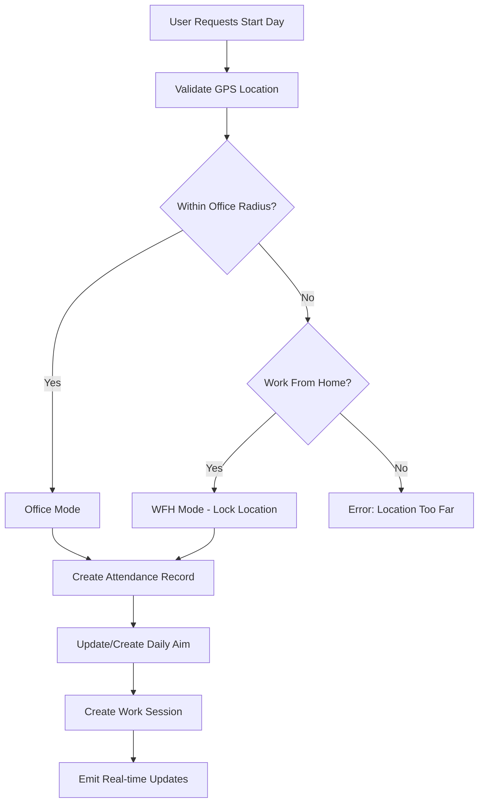
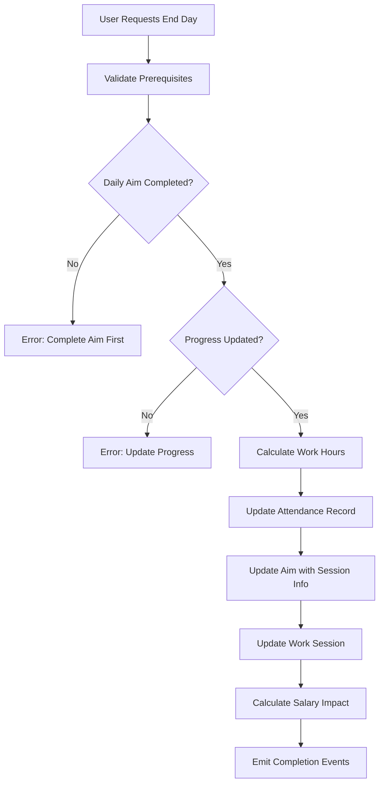

# Enhanced Attendance Management System

## 🚀 Overview

The Infiverse BHL Enhanced Attendance Management System is a comprehensive workforce tracking solution that integrates geolocation-based attendance, productivity monitoring, and seamless synchronization with daily aims and progress tracking.

## 🏗️ System Architecture

### Core Components
- **Attendance Tracking**: GPS-validated check-in/check-out system
- **Work Session Management**: Comprehensive session tracking with productivity metrics
- **Aim Integration**: Automatic synchronization with daily goals
- **Progress Sync**: Real-time progress updates reflected in aims
- **Analytics Dashboard**: Live monitoring and reporting

## 📊 What the System Captures

### 📍 Location Data
- **GPS Coordinates**: Precise latitude/longitude for start and end day
- **Address Resolution**: Automatic address lookup and validation
- **Distance Calculation**: Real-time distance from office premises
- **Work Location Type**: Office, Home, or Remote classification
- **Location Accuracy**: GPS accuracy measurements for validation
- **Geofencing**: Configurable office radius validation (default: 100m)

### ⏰ Time Tracking
- **Start Day Timestamp**: Precise check-in time with timezone handling
- **End Day Timestamp**: Check-out time with session duration
- **Total Hours Worked**: Automatic calculation with break time deduction
- **Regular vs Overtime**: Separation of standard and overtime hours
- **Break Time Management**: Configurable break periods and tracking
- **Auto End Day**: Automatic session termination after max hours

### 🏢 Work Session Information
- **Work Location Tag**: Visual indicators (Office/WFH/Remote)
- **Session Duration**: Real-time tracking of active work time
- **Productivity Scoring**: AI-powered productivity analysis
- **Device Information**: User agent, IP address, device type
- **Activity Monitoring**: Keystroke, mouse activity, and idle time

### 📈 Integration with Aims and Progress

#### 🎯 Aim Synchronization
```javascript
// Automatic sync when starting day
aim.workLocation = workLocationType; // Office/Home/Remote
aim.workSessionInfo = {
  startDayTime: startTime,
  workLocationTag: workLocationType === 'Home' ? 'WFH' : 'Office'
};

// Progress updates reflected in aims
aim.progressPercentage = progressData.percentage;
aim.progressNotes = progressData.notes;
aim.achievements = progressData.achievements;
aim.blockers = progressData.blockers;
```

#### 📊 Progress Integration
- **Real-time Updates**: Progress changes instantly reflected in aims
- **Achievement Tracking**: Daily accomplishments linked to work sessions
- **Blocker Management**: Issue tracking with resolution timelines
- **Task Completion**: Work hour correlation with task progress

## 🔄 System Workflow

### 1. Start Day Process


### 2. End Day Process


## 🗄️ Enhanced Data Models

### Aim Model (Enhanced)
```javascript
{
  // Existing fields...
  workLocation: String, // Office/Home/Remote
  progressPercentage: Number, // From progress updates
  progressNotes: String, // Daily progress notes
  achievements: String, // Daily achievements
  blockers: String, // Daily blockers
  workSessionInfo: {
    startDayTime: Date,
    endDayTime: Date,
    totalHoursWorked: Number,
    workLocationTag: String // Office/WFH/Remote
  }
}
```

### WorkSession Model (Updated)
```javascript
{
  employee: ObjectId,
  date: Date,
  startDayTime: Date, // From attendance
  endDayTime: Date, // From attendance
  workLocation: String, // Office/Home/Remote
  startLocation: {
    latitude: Number,
    longitude: Number,
    address: String,
    accuracy: Number
  },
  endLocation: {
    latitude: Number,
    longitude: Number,
    address: String,
    accuracy: Number
  },
  totalHoursWorked: Number,
  productivity: {
    keystrokeCount: Number,
    mouseActivity: Number,
    activeTime: Number,
    idleTime: Number,
    productivityScore: Number
  }
}
```

## 🔧 API Endpoints

### Core Attendance Operations
```javascript
// Start work day with location validation
POST /api/attendance/start-day/:userId
Body: {
  latitude: Number,
  longitude: Number,
  address: String,
  accuracy: Number,
  workFromHome: Boolean
}

// End work day with validation
POST /api/attendance/end-day/:userId
Body: {
  latitude: Number,
  longitude: Number,
  address: String,
  notes: String
}

// Get current day status
GET /api/attendance/today-status
Response: {
  hasStarted: Boolean,
  hasEnded: Boolean,
  currentHours: Number,
  canEndDay: Boolean,
  workLocation: String
}
```

### Enhanced Aim Integration
```javascript
// Sync progress to aims
POST /api/enhanced-aims/sync-progress-to-aim
Body: {
  userId: String,
  progressPercentage: Number,
  notes: String,
  achievements: String,
  blockers: String
}

// Sync attendance to aims
POST /api/enhanced-aims/sync-attendance-to-aim
Body: {
  userId: String,
  startDayTime: Date,
  endDayTime: Date,
  workLocation: String,
  totalHoursWorked: Number
}

// Get enhanced aims with all data
GET /api/enhanced-aims/enhanced?date=YYYY-MM-DD
Response: {
  success: Boolean,
  data: [
    {
      // Aim data
      aims: String,
      completionStatus: String,
      workLocation: String,
      progressPercentage: Number,
      workSessionInfo: Object,
      // Related data
      relatedProgress: Object,
      relatedAttendance: Object,
      relatedWorkSession: Object
    }
  ]
}
```

## 📊 Real-time Features

### Socket.IO Events
```javascript
// Attendance events
'attendance:day-started' - When user starts day
'attendance:day-ended' - When user ends day
'attendance:auto-day-ended' - Auto end day notification

// Aim synchronization events
'aim-updated' - When aim is updated with progress/attendance
'progress-synced' - When progress is synced to aim
'session-updated' - When work session is updated
```

### Live Dashboard Updates
- Real-time attendance status changes
- Live work location indicators (Office/WFH tags)
- Progress percentage updates in aims
- Work session duration tracking
- Productivity score updates

## 🎯 Enhanced All Aims View

### New Display Features
```jsx
// Work Location Tags
<span className={`px-2 py-1 text-xs rounded-full ${
  aim.workSessionInfo?.workLocationTag === 'WFH' 
    ? 'bg-blue-100 text-blue-800' 
    : 'bg-green-100 text-green-800'
}`}>
  {aim.workSessionInfo?.workLocationTag || 'Office'}
</span>

// Progress Information Section
{(aim.progressNotes || aim.achievements || aim.blockers) && (
  <div className="mt-3 p-3 bg-gray-50 rounded-lg">
    <h4 className="text-xs font-semibold text-gray-700 mb-2">Daily Progress</h4>
    {/* Progress details */}
  </div>
)}

// Work Session Information
{aim.workSessionInfo && (
  <div className="mt-3 p-3 bg-blue-50 rounded-lg">
    <h4 className="text-xs font-semibold text-blue-700 mb-2">Work Session</h4>
    {/* Session details */}
  </div>
)}
```

## 🔒 Security & Validation

### Location Security
- **GPS Spoofing Detection**: Advanced algorithms to detect fake locations
- **Device Fingerprinting**: Unique device identification for security
- **IP Address Validation**: Cross-reference with expected network ranges
- **Geofencing Accuracy**: Configurable radius with accuracy thresholds

### Data Validation
- **Mandatory Validations**: Aim completion and progress updates required
- **Time Consistency**: Logical validation of start/end times
- **Location Consistency**: Validation of location changes during day
- **Session Integrity**: Validation of work session data

## 📈 Analytics & Reporting

### Enhanced Metrics
- **Location-based Productivity**: Office vs WFH performance comparison
- **Aim Completion Correlation**: Work hours vs goal achievement rates
- **Progress Tracking Efficiency**: Real-time progress update patterns
- **Work Session Analytics**: Detailed session performance metrics

### Automated Reports
- **Daily Attendance Summary**: With location tags and progress status
- **Weekly Productivity Report**: Including aim completion rates
- **Monthly Work Pattern Analysis**: Location preferences and efficiency
- **Quarterly Performance Review**: Comprehensive productivity assessment

## 🚀 Implementation Benefits

### For Employees
- **Seamless Integration**: Progress updates automatically reflected in aims
- **Location Flexibility**: Support for office and remote work
- **Real-time Feedback**: Instant visibility into work patterns
- **Goal Alignment**: Clear connection between daily work and objectives

### For Managers
- **Comprehensive Visibility**: Complete view of team productivity
- **Real-time Monitoring**: Live updates on team status and progress
- **Data-driven Decisions**: Rich analytics for performance management
- **Automated Compliance**: Built-in validation and reporting

### For Organizations
- **Workforce Optimization**: Data-driven insights for productivity improvement
- **Compliance Management**: Automated tracking and reporting
- **Cost Efficiency**: Accurate time tracking and salary calculations
- **Scalable Solution**: Supports growing teams and complex workflows

## 🔧 Configuration Options

### Environment Variables
```bash
# Office Location (Blackhole Infiverse LLP Mumbai)
OFFICE_LAT=19.165492
OFFICE_LNG=72.835340
OFFICE_RADIUS=100

# Working Hours
MAX_WORKING_HOURS=8
AUTO_END_DAY_ENABLED=true

# Validation Settings
STRICT_LOCATION_CHECK=true
ALLOW_REMOTE_WORK=true
PROGRESS_VALIDATION_REQUIRED=true
AIM_COMPLETION_REQUIRED=true
```

This enhanced attendance system provides a comprehensive solution for modern workforce management with seamless integration between attendance tracking, goal management, and productivity monitoring.